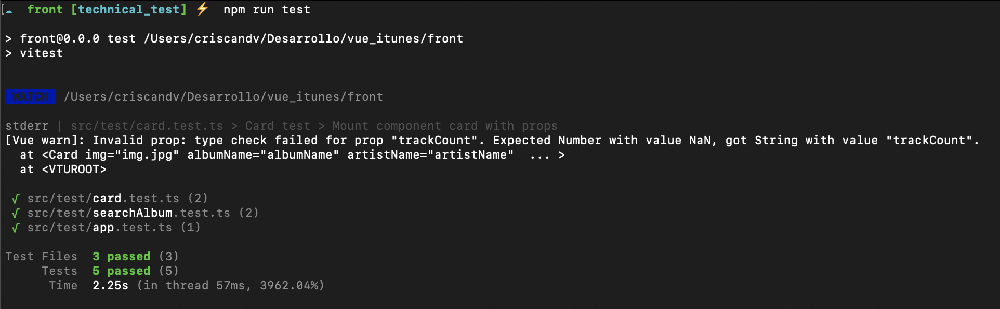
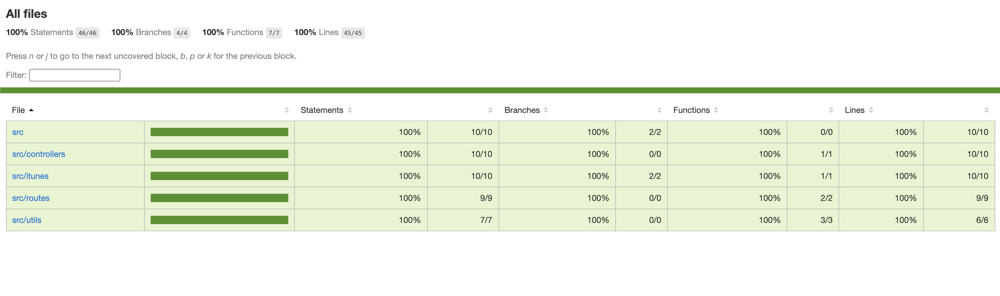

## Vue iTunes

The project is divided on two subprojects.
To run the project, docker-compose is available to execute:
`docker-compose up -d`

### API

Contains all the backend of the application. It was made on express, and the tests was made with jest and supertest.
If you don't want to use docker, you can execute:

```bash
npm install # To install packages
npm start # Run the api server
npm run test # Run the tests
```

### FRONT

Contains all the frontend of the application. It was made with:

- Vue 3
- Vite
- Axios
- Tailwindcss
- Vitest

If you don't want to use docker, you can execute:

```bash
npm install # To install packages
npm run dev # Run the frontend server
npm run test # Run the tests
```

### Unit testing

To test the application, you need to previously install the packages in both of the projects (api, front). Then you should execute `npm run test` in each folder.

The next you can se is:
<br>


<br>

